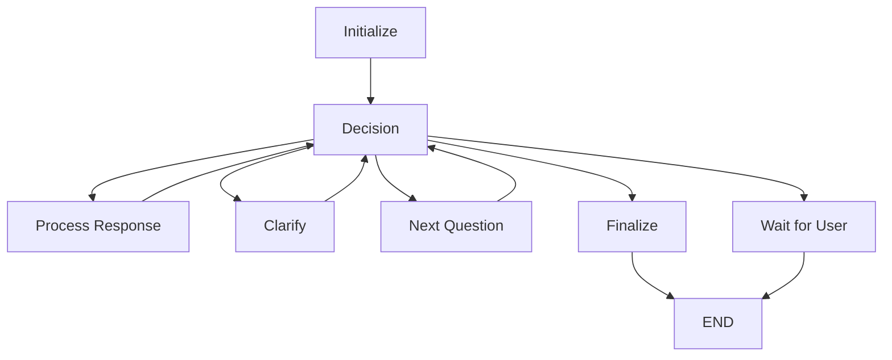

# Agente Conversacional de RRHH - Adaptiera

Este módulo implementa un agente conversacional inteligente para entrevistas de RRHH usando **LangGraph**, basado en la arquitectura de grafos de estados.

## 🏗️ Arquitectura

El agente está construido con los siguientes componentes:

### Estado (`state.py`)
- `ConversationState`: Mantiene el contexto completo de la conversación
- Historial de mensajes, preguntas pendientes, respuestas del usuario
- Flags para control de flujo (necesita aclaración, conversación completa)

### Nodos (`nodes/conversation_nodes.py`)
- `initialize_conversation_node`: Carga preguntas e inicia la conversación
- `process_user_response_node`: Evalúa respuestas usando Groq LLM
- `clarification_node`: Solicita aclaraciones cuando es necesario
- `next_question_node`: Avanza a la siguiente pregunta
- `finalize_conversation_node`: Guarda respuestas y envía correo
- `decision_node`: Controla el flujo del grafo

### Herramientas (`tools/`)
- `file_search_tool.py`: Búsqueda y carga de preguntas desde archivos
- `email_tool.py`: Envío de correos con resúmenes de entrevistas

### Agente Principal (`langgraph_agent.py`)
- `AdaptieraRRHHAgent`: Clase principal que orquesta todo el flujo
- Integración completa con LangGraph
- API simple para uso en aplicaciones

## 🚀 Uso Básico

```python
from agents.langgraph_agent import create_rrhh_agent

# Crear el agente
agent = create_rrhh_agent()

# Iniciar conversación
initial_message = agent.start_conversation()
print(initial_message)

# Procesar respuestas del usuario
while not agent.is_conversation_complete():
    user_input = input("Tu respuesta: ")
    response = agent.process_user_input(user_input)
    print(response)

# Obtener resumen
summary = agent.get_conversation_summary()
print(summary)
```

## ⚙️ Configuración

### Variables de Entorno Requeridas

Crea un archivo `.env` en la raíz del proyecto con:

```bash
# API Key de Groq para el modelo de lenguaje
GROQ_API_KEY=tu_api_key_de_groq_aqui

# Configuración de correo electrónico
SMTP_SERVER=smtp.gmail.com
SMTP_PORT=587
SENDER_EMAIL=tu_email@gmail.com
SENDER_PASSWORD=tu_password_de_aplicacion
RECIPIENT_EMAIL=rrhh@adaptiera.com
```

### Archivo de Preguntas

El agente busca preguntas en `data/questions.json`. Si no existe, crea uno automáticamente con preguntas por defecto.

Formato esperado:
```json
{
  "questions": [
    "¿Cuál es tu nombre completo?",
    "¿Cuál es tu experiencia laboral previa?",
    "¿Qué habilidades técnicas posees?",
    "¿Por qué estás interesado en esta posición?",
    "¿Cuáles son tus expectativas salariales?"
  ]
}
```

## 🧪 Pruebas

Ejecuta el script de prueba:

```bash
python agents/test_agent.py
```

Opciones disponibles:
1. **Prueba automática**: Simula una conversación completa
2. **Prueba interactiva**: Permite interactuar manualmente con el agente

## 🔄 Flujo del Grafo



## 🎯 Características Principales

### ✅ Implementado
- ✅ Grafo de estados con LangGraph
- ✅ Integración con Groq LLM
- ✅ Evaluación inteligente de respuestas
- ✅ Sistema de repreguntas automático
- ✅ Carga de preguntas desde archivos
- ✅ Guardado de respuestas
- ✅ Envío de correos (simulado)
- ✅ Manejo de estado conversacional
- ✅ API simple y limpia

### 🔮 Futuras Extensiones
- 🔮 Integración con voz (STT/TTS)
- 🔮 Capacidades de visión (OCR)
- 🔮 Base de datos persistente
- 🔮 Interfaz web con Streamlit
- 🔮 Métricas y analytics
- 🔮 Múltiples idiomas

## 🛠️ Desarrollo

### Estructura de Archivos
```
agents/
├── __init__.py              # Exportaciones principales
├── agent.py                 # Compatibilidad y wrapper
├── langgraph_agent.py       # Agente principal
├── state.py                 # Estado conversacional
├── test_agent.py           # Script de pruebas
├── README.md               # Esta documentación
├── nodes/
│   ├── __init__.py
│   └── conversation_nodes.py
└── tools/
    ├── __init__.py
    ├── file_search_tool.py
    └── email_tool.py
```

### Agregar Nuevos Nodos

1. Crear función en `nodes/conversation_nodes.py`
2. Agregar al grafo en `langgraph_agent.py`
3. Actualizar lógica de decisión si es necesario

### Agregar Nuevas Herramientas

1. Crear archivo en `tools/`
2. Usar decorador `@tool` de LangChain
3. Importar en los nodos que la necesiten

## 📝 Notas Técnicas

- **LangGraph**: Framework de grafos de estados sobre LangChain
- **Groq**: LLM rápido para evaluación de respuestas
- **Estado Inmutable**: Cada nodo retorna un nuevo estado
- **Aristas Condicionales**: Control de flujo dinámico
- **Herramientas Externas**: Integración con APIs y servicios

## 🐛 Troubleshooting

### Error: "GROQ_API_KEY no configurada"
- Asegúrate de tener el archivo `.env` con tu API key de Groq

### Error al cargar preguntas
- Verifica que el directorio `data/` existe
- El agente creará archivos por defecto si no existen

### Error al enviar correo
- Verifica las credenciales de correo en `.env`
- Usa el modo simulado para pruebas (`simulate_email_send`)

---

**Desarrollado para Adaptiera** 🚀 